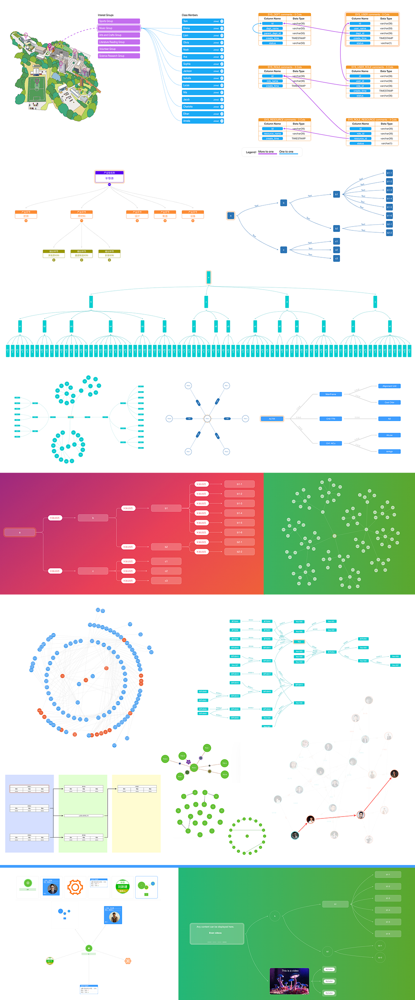
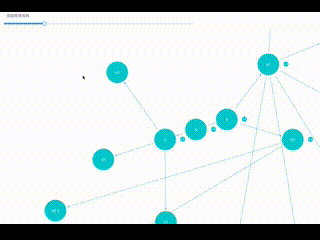
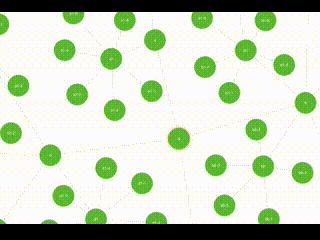
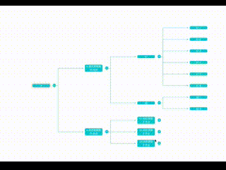
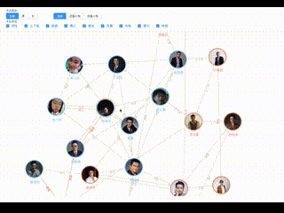
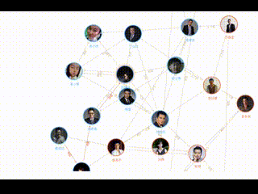
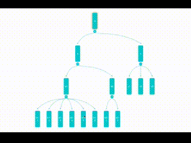
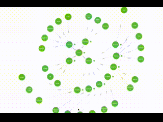

# relation-graph


- **relation-graph** 是支持Vue2、Vue3、React的关系数据展示组件，支持通过【插槽】让使用者使用"普通HTML元素、Vue组件、React组件"来完全自定义图形元素，并提供实用的API接口让使用者轻松构建可交互的图形应用。<br />
-  除了典型的关系数据展示功能，relation-graph还支持作为一个画板来使用，你可以在画板上放置任何内容，只需要为想要连接的元素设置id，同时定义"元素连线（Element Lines）"即可。轻松实现一个可任意创建连线、可缩放与拖动、支持通过API轻松实现动态交互的画板。
- **relation-graph** is a relationship data display component that supports Vue 2, Vue 3, and React. It enables users to fully customize graphical elements using "common HTML elements, Vue components, React components" through slots, and provides practical API interfaces to facilitate the development of interactive graphical applications."<br />
-  In addition to the typical relationship data display functionality, the relation-graph also supports being used as a drawing board. You can place any content on the drawing board, simply by setting an id for the elements you want to connect, and defining "element lines." This allows for the easy creation of a drawing board that supports the creation of arbitrary connections, zooming and dragging, and dynamic interactions through the API.
### Docs & Examples  文档 & 示例：

- [https://relation-graph.com](https://relation-graph.com)  （国内用户，无需科学上网）

- [https://relation-graph.github.io](https://relation-graph.github.io)（For regions outside of China）

上面的网站中包含使用文档、在线示例，以及可视化的配置工具。<br>
The website above includes documentation, online demos, and a visual configuration tool for software developers.

### Getting Started  快速使用：

```shell script
npm install --save relation-graph
```
```shell script
# 注意：relation-graph支持Vue2、Vue3、React, 引入的包名称都是"relation-graph" 但在使用时，根据你的环境，需要引入不同的名称
# Note: relation-graph supports Vue2, Vue3, React, but the package name for import is always "relation-graph".
# 
# Vue2： import RelationGraph from 'relation-graph'
# Vue3： import RelationGraph from 'relation-graph/vue3'
# React： import RelationGraph from 'relation-graph/react'
```

```vue
<template>
  <div>
    <div style="height:calc(100vh - 60px);">
      <RelationGraph ref="graphRef" :options="graphOptions" :on-node-click="onNodeClick" :on-line-click="onLineClick" />
    </div>
  </div>
</template>

<script>
// relation-graph also supports usage in the main.js file with Vue.use(RelationGraph); this way, you don't need the following line of code for import.
import RelationGraph from 'relation-graph'
export default {
  name: 'Demo',
  components: { RelationGraph },
  data() {
    return {
      graphOptions: {
        allowSwitchLineShape: true,
        allowSwitchJunctionPoint: true,
        defaultJunctionPoint: 'border'
        // Here you can refer to the options in "Graph" for setting: https://seeksdream.github.io/#/docs/graph
      }
    }
  },
  mounted() {
    this.showGraph()
  },
  methods: {
    showGraph() {
      const jsonData = {
        rootId: 'a',
        nodes: [
          { id: 'a', text: 'A', borderColor: 'yellow' },
          { id: 'b', text: 'B', color: '#43a2f1', fontColor: 'yellow' },
          { id: 'c', text: 'C', nodeShape: 1, width: 80, height: 60 },
          { id: 'e', text: 'E', nodeShape: 0, width: 150, height: 150 }
        ],
        lines: [
          { from: 'a', to: 'b', text: 'line1', color: '#43a2f1' },
          { from: 'a', to: 'c', text: 'line2' },
          { from: 'a', to: 'e', text: 'line3' },
          { from: 'b', to: 'e', color: '#67C23A' }
        ]
      }
      // The node and link in the above data can refer to the options in "Node" and "Link & Line" for configuration.
      // Node: https://seeksdream.github.io/#/docs/node
      // Link & Line: https://seeksdream.github.io/#/docs/link
      this.$refs.graphRef.setJsonData(jsonData, (graphInstance) => {
        // Called when the relation-graph is completed
      });
      // The this.refs.graphRef.setJsonData(jsonData, callback) method is a convenient method that is equivalent to the following code:
      //  const graphInstance = this.refs.graphRef.getInstance();
      //  graphInstance.addNodes(jsonData.nodes);
      //  graphInstance.addLines(jsonData.lines);
      //  graphInstance.rootNode = graphInstance.getNodeById(jsonData.rootId);
      //  await graphInstance.doLayout(); // Layout using the layouter set in graphOptions
      //  await graphInstance.moveToCenter(); // Find the center based on node distribution and center the view
      //  await graphInstance.zoomToFit(); // Zoom to fit, so that all nodes can be displayed in the visible area
    },
    onNodeClick(nodeObject, $event) {
      console.log('onNodeClick:', nodeObject)
    },
    onLineClick(lineObject, $event) {
      console.log('onLineClick:', lineObject)
    }
  }
}
</script>
```


### Sample code effects  上面代码的效果：


### Example Projects  完整的示例代码：

- The complete Vue2 sample project: / Vue3完整小示例: 
- https://github.com/seeksdream/relation-graph-vue3-demo

- The complete Vue3 sample project: / React完整小示例: 
- https://github.com/seeksdream/relation-graph-react-demo

- The complete React sample project: / vue2完整小示例: 
- https://github.com/seeksdream/relation-graph-vue2-demo


### More Examples   更多示例：
- [https://relation-graph.com/#/demo](https://relation-graph.com/#/demo)  （国内用户，无需科学上网）

- [https://relation-graph.github.io/#/demo](https://relation-graph.github.io/#/demo)（For regions outside of China）




 








### The complete sample project 完整的、可运行的示例项目：

- The complete Vue2 sample project & vue2完整小示例：
- https://github.com/seeksdream/relation-graph-vue2-demo

- The complete Vue3 sample project & vue3完整小示例：
- https://github.com/seeksdream/relation-graph-vue3-demo

- The complete React sample project & React完整小示例：
- https://github.com/seeksdream/relation-graph-react-demo


### More info  更多效果及使用方法：

- [https://relation-graph.com](https://relation-graph.com)  （国内用户，无需科学上网）

- [https://relation-graph.github.io](https://relation-graph.github.io)（For regions outside of China）

### Contact me  与我联系： 

- 我的QQ：3235808353
- My WhatsApp:

  

