---

relation-graph 2.0.41(支持Vue2、Vue3、React、移动端)

**relation-graph是一个展示关系数据的组件，支持通过【插槽】让使用者用【html+css编写的vue/react组件】来完全自定义图形元素，使用css样式/动画来完全自定义样式效果。让你快速构建可交互的复杂图形应用。**
---

这是一个Vue关系图谱组件，可以展示如组织机构图谱、股权架构图谱、集团关系图谱等知识图谱，可提供多种图谱布局，包括树状布局、中心布局、力学布局自动布局等。

这个项目使用典型的vue编程方式，代码简单易懂。如果需要实现一些自定义的高级功能，你可以直接使用源码作为一个component放到你的项目中去用，轻松、任意的修改。


*详细使用方法、配置选项、在线demo，以及可视化的配置工具，可以访问这个网址：*

---
*文档 & 示例：*
---

[http://relation-graph.com](http://relation-graph.com)  （国内用户，无需科学上网）

[https://seeksdream.github.io](https://seeksdream.github.io)（For regions outside of China）

---
*快速使用：*

```shell script
npm install --save relation-graph
```
```shell script
注意：
relation-graph支持Vue2、Vue3、React, 引入的包名称都是【relation-graph】
但在使用时，根据你的环境，需要引入不同的名称
Vue2使用方法： import RelationGraph from 'relation-graph'
Vue3使用方法： import RelationGraph from 'relation-graph/vue3'
React使用方法： import RelationGraph from 'relation-graph/react'
```

**示例代码：**
```vue
//（以下为Vue2示例代码，如果你使用的是Vue3或者React）
// Vue3完整小示例：https://github.com/seeksdream/relation-graph-vue3-demo
// React完整小示例：https://github.com/seeksdream/relation-graph-react-demo
// vue2完整小示例：https://github.com/seeksdream/relation-graph-vue2-demo

```

```vue
<template>
  <div>
    <div style="height:calc(100vh - 50px);">
      <RelationGraph
        ref="graphRef"
        :options="graphOptions"
        :on-node-click="onNodeClick"
        :on-line-click="onLineClick"
      />
    </div>
  </div>
</template>

<script>
import RelationGraph from 'relation-graph'
export default {
  name: 'Demo',
  components: { RelationGraph },
  data() {
    return {
      graphOptions: {
        allowSwitchLineShape: true,
        allowSwitchJunctionPoint: true,
        defaultJunctionPoint: 'border'
        // 这里可以参考"Graph 图谱"中的参数进行设置:http://relation-graph.com/#/docs/graph
      }
    }
  },
  mounted() {
    this.showGraph()
  },
  methods: {
    showGraph() {
      var __graph_json_data = {
        rootId: 'a',
        nodes: [
          // node配置选项：http://relation-graph.com/#/docs/node
          // node支持通过插槽slot完全自定义，示例：http://relation-graph.com/#/demo/adv-slot
          { id: 'a', text: 'A', borderColor: 'yellow' },
          { id: 'b', text: 'B', color: '#43a2f1', fontColor: 'yellow' },
          { id: 'c', text: 'C', nodeShape: 1, width: 80, height: 60 },
          { id: 'e', text: 'E', nodeShape: 0, width: 150, height: 150 }
        ],
        lines: [
          // link配置选项：http://relation-graph.com/#/docs/link
          { from: 'a', to: 'b', text: '关系1', color: '#43a2f1' },
          { from: 'a', to: 'c', text: '关系2' },
          { from: 'a', to: 'e', text: '关系3' },
          { from: 'b', to: 'e', color: '#67C23A' }
        ]
      }
      this.$refs.graphRef.setJsonData(__graph_json_data, (seeksRGGraph) => {
        // Called when the relation-graph is completed 
      })
    },
    onNodeClick(nodeObject, $event) {
      console.log('onNodeClick:', nodeObject)
    },
    onLineClick(linkObject, $event) {
      console.log('onLineClick:', linkObject)
    }
  }
}
</script>
```

完整的、可运行的示例项目：

*vue2完整小示例：https://github.com/seeksdream/relation-graph-vue2-demo*

vue3完整小示例：https://github.com/seeksdream/relation-graph-vue3-demo

React完整小示例：https://github.com/seeksdream/relation-graph-react-demo


*上面代码的效果：*

*更多示例图：*


##基本


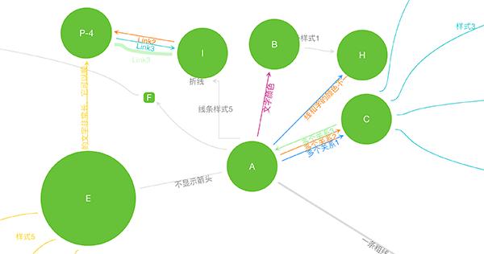


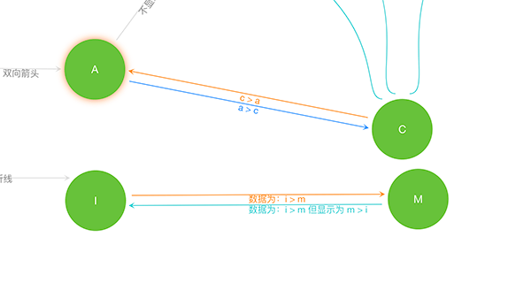

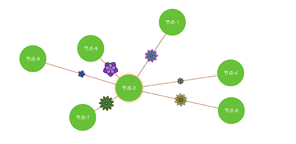


##布局

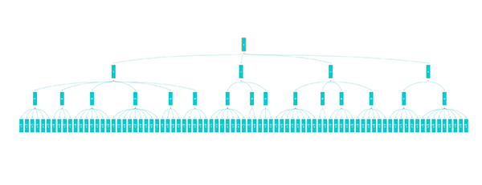


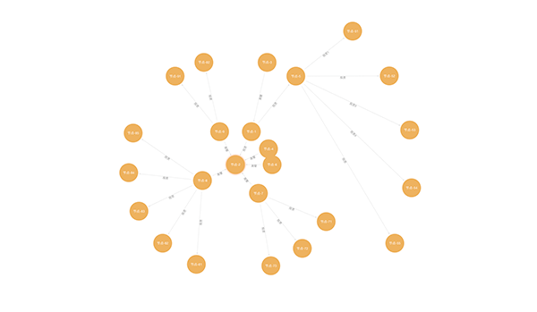


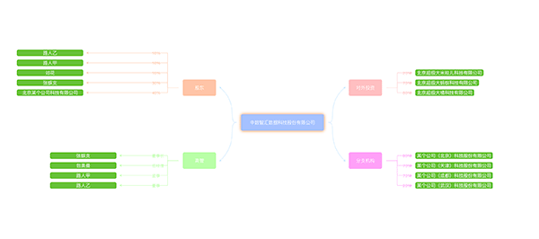


##使用场景


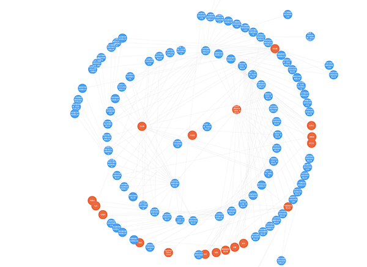

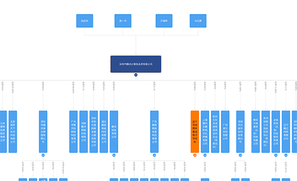


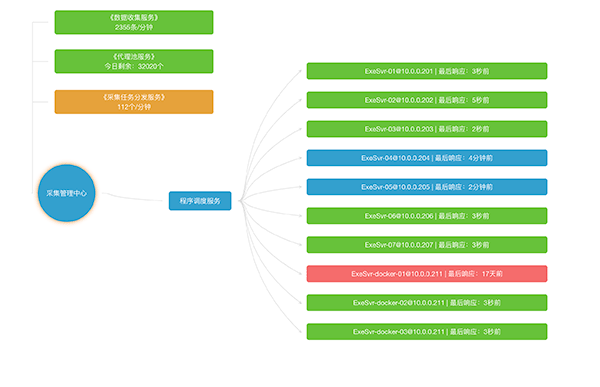


##高级 & 交互

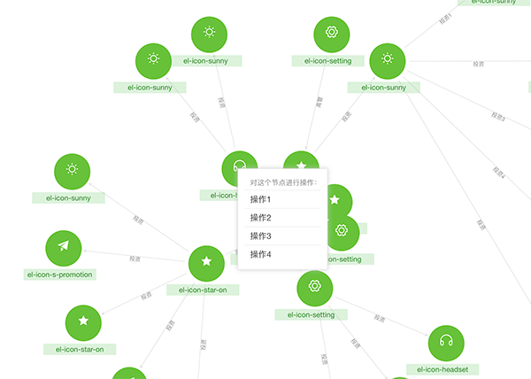

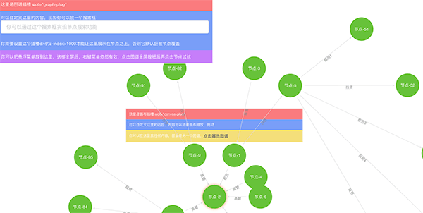

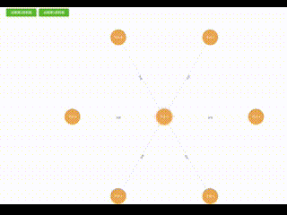


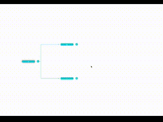


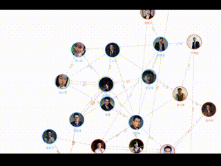


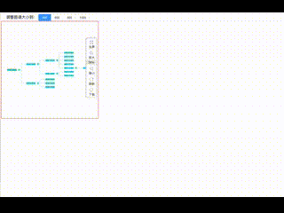


##更多示例：
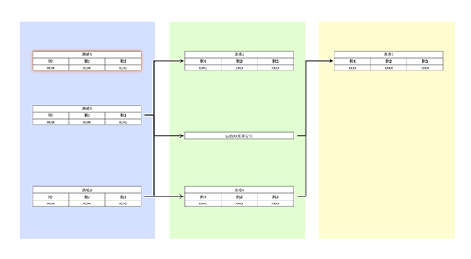

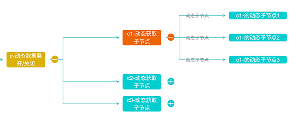

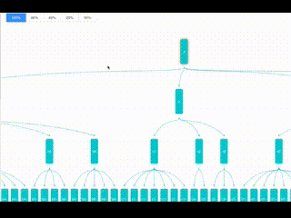


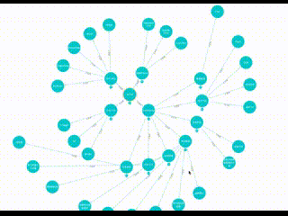


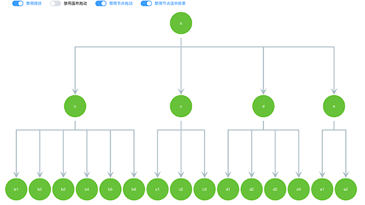

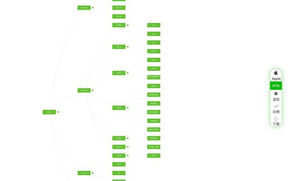

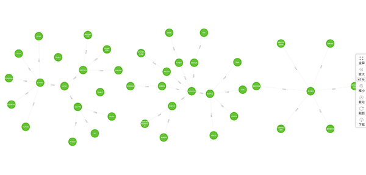

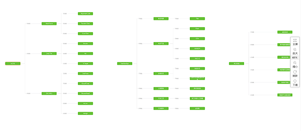

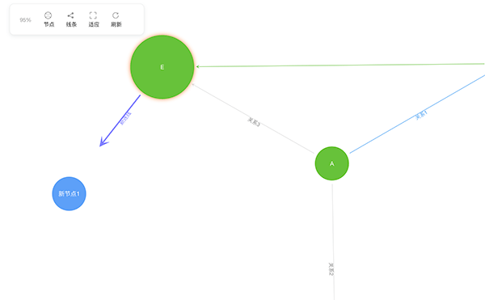

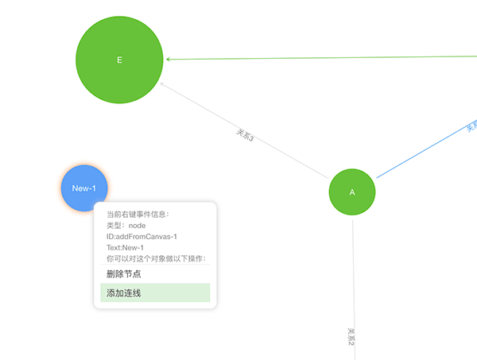


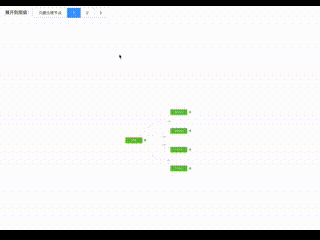

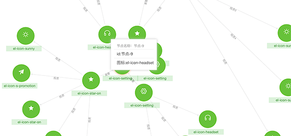

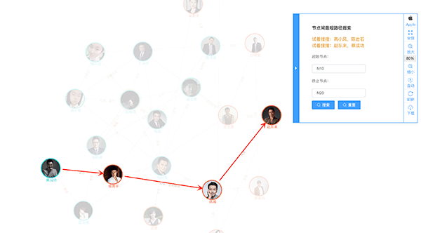

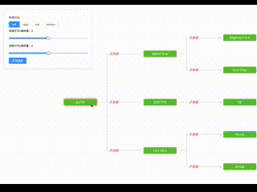

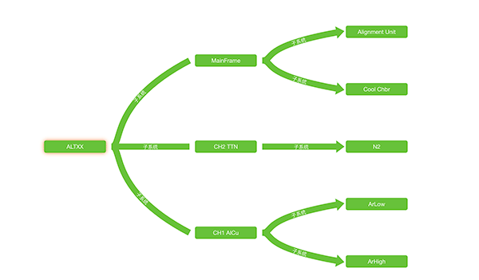

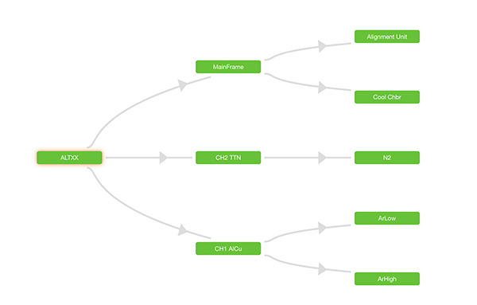

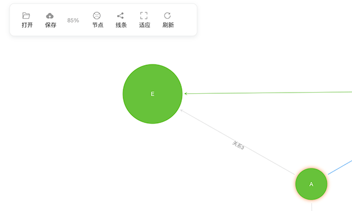

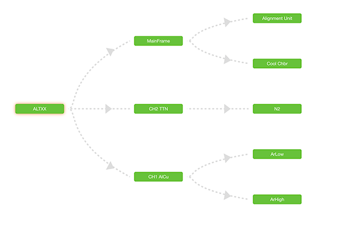

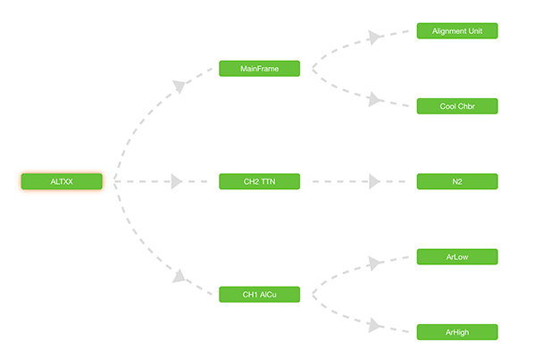

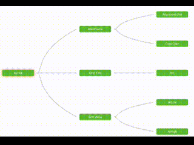

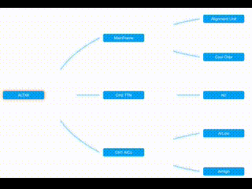

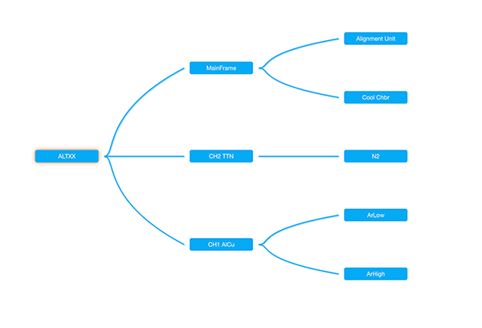


*更多效果及使用方法：*

[http://relation-graph.com](http://relation-graph.com)  （国内用户，无需科学上网）

[https://seeksdream.github.io](https://seeksdream.github.io)（For regions outside of China）


**有问题可以加QQ：3235808353，提bug、提建议、一起交流分享前端开发心得，第一获取新版本发布消息。**


