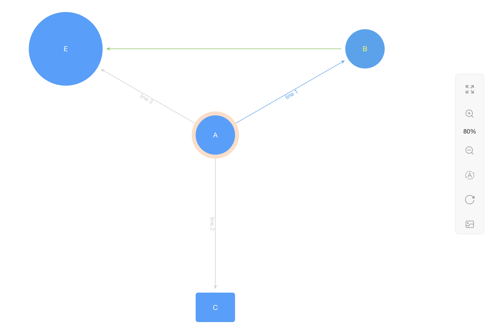

---

relation-graph 当前版本：v2.0.19 (支持Vue2、Vue3、React)

----


**2023-02-19 版本v2.0.12起开始支持vue3**

**2023-02-24 版本v2.0.19起开始支持react**
```shell script
Vue2使用方法： import RelationGraph from 'relation-graph'
Vue3使用方法： import RelationGraph from 'relation-graph/vue3'
React使用方法： import RelationGraph from 'relation-graph/react'
vue2完整小示例：https://github.com/seeksdream/relation-graph-vue2-demo
vue3完整小示例：https://github.com/seeksdream/relation-graph-vue3-demo
React完整小示例：https://github.com/seeksdream/relation-graph-react-demo
```

**2023-02-24 最新版本v2.0.24**

新增circle布局，环形布局

**2023-02-24 最新版本v2.0.25**

将默认选项options.moveToCenterWhenRefresh的默认值修改为true

---

这是一个Vue关系图谱组件，可以展示如组织机构图谱、股权架构图谱、集团关系图谱等知识图谱，可提供多种图谱布局，包括树状布局、中心布局、力学布局自动布局等。

这个项目使用典型的vue编程方式，代码简单易懂。如果需要实现一些自定义的高级功能，你可以直接使用源码作为一个component放到你的项目中去用，轻松、任意的修改。

*详细使用方法、配置选项、在线demo，以及可视化的配置工具，可以访问这个网址：*

[http://relation-graph.com](http://relation-graph.com)  （国内用户，无需科学上网）

[https://seeksdream.github.io](https://seeksdream.github.io)（For regions outside of China）

---
*快速使用：*

```shell script
npm install --save relation-graph
```
```shell script
注意：
relation-graph支持Vue2、Vue3、React, 引入的包名称都是【relation-graph】
但在使用时，根据你的环境，需要引入不同的名称
Vue2使用方法： import RelationGraph from 'relation-graph'
Vue3使用方法： import RelationGraph from 'relation-graph/vue3'
React使用方法： import RelationGraph from 'relation-graph/react'
```

**示例代码：**
```vue
//（以下为Vue2示例代码，如果你使用的是Vue3或者React）
// Vue3完整小示例：https://github.com/seeksdream/relation-graph-vue3-demo
// React完整小示例：https://github.com/seeksdream/relation-graph-react-demo
```

```vue
<template>
   <div>
     <div style="height:calc(100vh - 50px);">
        <RelationGraph ref="seeksRelationGraph" :options="graphOptions" :on-node-click="onNodeClick" :on-line-click="onLineClick" />
     </div>
   </div>
 </template>
 
 <script>
 import RelationGraph from 'relation-graph'
 export default {
   name: 'Demo',
   components: { RelationGraph },
   data() {
     return {
       graphOptions: {
         allowSwitchLineShape: true,
         allowSwitchJunctionPoint: true,
         defaultJunctionPoint: 'border'
         // 这里可以参考"Graph 图谱"中的参数进行设置:http://relation-graph.com/#/docs/graph
       }
     }
   },
   mounted() {
     this.showSeeksGraph()
   },
   methods: {
     showSeeksGraph() {
       var __graph_json_data = {
         rootId: 'a',
         nodes: [
            // node配置选项：http://relation-graph.com/#/docs/node
            // node支持通过插槽slot完全自定义，示例：http://relation-graph.com/#/demo/adv-slot
           { id: 'a', text: 'A', borderColor: 'yellow' },
           { id: 'b', text: 'B', color: '#43a2f1', fontColor: 'yellow' },
           { id: 'c', text: 'C', nodeShape: 1, width: 80, height: 60 },
           { id: 'e', text: 'E', nodeShape: 0, width: 150, height: 150 }
         ],
         lines: [
            // link配置选项：http://relation-graph.com/#/docs/link
           { from: 'a', to: 'b', text: '关系1', color: '#43a2f1' },
           { from: 'a', to: 'c', text: '关系2' },
           { from: 'a', to: 'e', text: '关系3' },
           { from: 'b', to: 'e', color: '#67C23A' }
         ]
       }
       this.$refs.seeksRelationGraph.setJsonData(__graph_json_data, (seeksRGGraph) => {
         // Called when the relation-graph is completed 
       })
     },
     onNodeClick(nodeObject, $event) {
       console.log('onNodeClick:', nodeObject)
     },
     onLineClick(linkObject, $event) {
       console.log('onLineClick:', linkObject)
     }
   }
 }
 </script>
```

完整的、可运行的示例项目：

vue2完整小示例：https://github.com/seeksdream/relation-graph-vue2-demo
vue3完整小示例：https://github.com/seeksdream/relation-graph-vue3-demo
React完整小示例：https://github.com/seeksdream/relation-graph-react-demo


*上面代码的效果：*



*更多效果及使用方法：*

[http://relation-graph.com](http://relation-graph.com)  （国内用户，无需科学上网）

[https://seeksdream.github.io](https://seeksdream.github.io)（For regions outside of China）

---

**v2.x版本重要新特性：**

* 修改了线条文字的展示方式，现在线条文字会跟随线条轨迹走
* 新增线条插槽
* 新增画布插槽

这个项目使用典型的vue编程方式，代码简单易懂，如果需要实现一些高级功能，你还可以直接使用源码作为一个component放到你的项目中去用，如果有一些优化或者新特性，欢迎提交pull request。

**有问题可以加QQ：3235808353，提bug、提建议、一起交流分享前端开发心得，第一获取新版本发布消息。**


